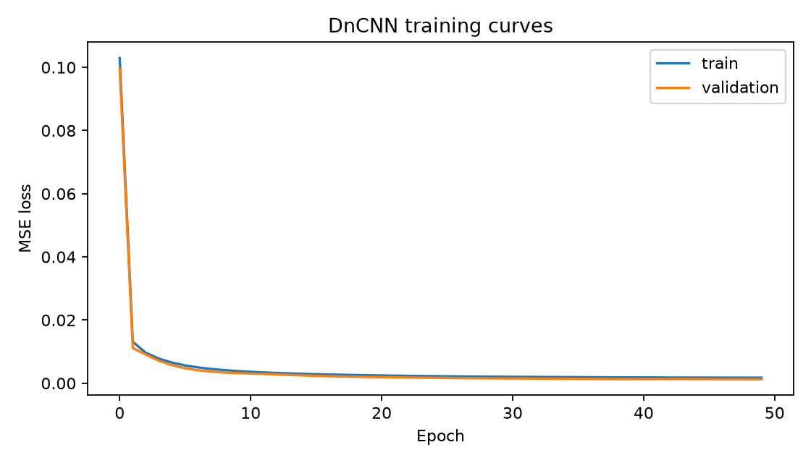

## Reproduced experiment results

The reported experiment used an 8-layer residual DnCNN with 32 filters, source-level train/validation/test splitting, 128 patches per training image, and synthetic Gaussian noise with σ = 25 on the 0–255 intensity scale.

| Metric | Noisy baseline | Residual DnCNN | Improvement |
|---|---:|---:|---:|
| MSE | 0.00863 | 0.00094 | 89.06% reduction |
| PSNR | 20.67 dB | 30.33 dB | +9.66 dB |
| SSIM | 0.9038 | 0.9890 | +0.0853 |

These results were measured on held-out source images from the nine-image demonstration dataset. They show performance under reproducible synthetic Gaussian noise and do not establish clinical effectiveness on real low-dose CT data.

