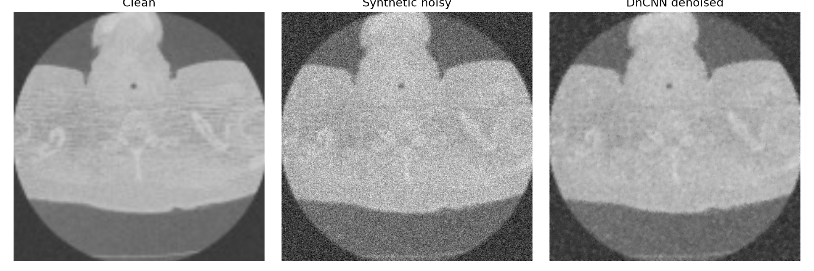
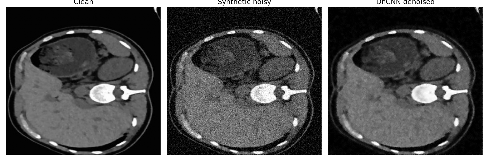

# Reproducible CT Image Denoising with Residual DnCNN

[](https://github.com/Abhinavguptap/Ct-image-denoising/actions/workflows/ci.yml)

A reproducible TensorFlow pipeline for denoising grayscale CT images using a residual-learning DnCNN. The project includes source-level dataset splitting, seeded synthetic-noise generation, baseline comparison, quantitative evaluation, experiment tracking, automated tests, and GitHub Actions CI.

> **Research-use disclaimer:** This is an educational machine-learning prototype, not a medical device. It has not been clinically validated and must not be used for diagnosis or patient care.

## Results

The reproduced experiment used:

- 8 convolutional layers
- 32 feature maps per hidden layer
- 64 × 64 training patches
- 128 patches per training image
- Batch size of 16
- Initial learning rate of 0.0005
- Random seed of 42
- Synthetic Gaussian noise with σ = 25 on the 0–255 intensity scale
- Source-level train, validation and test splitting

| Metric | Noisy baseline | Residual DnCNN | Improvement |
|---|---:|---:|---:|
| MSE | 0.00863 | 0.00094 | 89.06% reduction |
| PSNR | 20.67 dB | 30.33 dB | +9.66 dB |
| Global SSIM | 0.9038 | 0.9890 | +0.0853 |

The results were measured on two held-out source images from a nine-image demonstration dataset. They demonstrate performance under reproducible synthetic Gaussian noise and do not establish clinical effectiveness on real low-dose CT data.

Full-precision results are available in [`artifacts/metrics.json`](artifacts/metrics.json), while the exact experiment configuration is preserved in [`artifacts/config.json`](artifacts/config.json).

### Training curves


### Held-out examples

#### Test image: img6.png



#### Test image: img9.jpg



## Methodology

The original repository contained nine clean images and nine separately collected noisy images. Files with matching names have different dimensions or crops, so they cannot be treated as registered pixel-aligned training pairs.

To avoid invalid pixel-wise supervision and misleading evaluation, this pipeline:

1. Uses the images in `Clean/` as source images.
2. Splits source images into training, validation and test sets before patch extraction.
3. Generates seeded synthetic Gaussian noise from the clean images.
4. Extracts augmented patches only after source-level splitting.
5. Trains the network to predict the noise residual.
6. Reconstructs the denoised image as:

```text
denoised image = noisy image - predicted noise
```

7. Compares the trained model with the unprocessed noisy-input baseline.
8. Reports MSE, PSNR and global SSIM on held-out source images.

Splitting by source image prevents patches from the same image from appearing in both training and evaluation data.

The original `noisy/` directory is retained only for qualitative inference. It is not used for quantitative paired evaluation.

## Model architecture

The model follows the residual-learning approach introduced by DnCNN:

1. Initial convolution followed by ReLU
2. Configurable Conv2D, Batch Normalization and ReLU blocks
3. Final convolution that predicts the noise residual

The architecture is configurable through command-line arguments:

- `--depth`
- `--filters`
- `--noise-sigma`
- `--patch-size`
- `--patches-per-image`
- `--learning-rate`
- `--seed`

The reported experiment used an 8-layer network with 32 filters to provide a practical balance between learning capacity and CPU training time.

## Repository structure

```text
.
├── .github/
│   └── workflows/
│       └── ci.yml
├── Clean/
│   └── clean demonstration images
├── noisy/
│   └── unregistered noisy images for qualitative inference
├── artifacts/
│   ├── comparisons/
│   │   ├── img6_comparison.png
│   │   └── img9_comparison.png
│   ├── best_model.keras
│   ├── config.json
│   ├── metrics.json
│   ├── training_curves.png
│   └── training_history.csv
├── ct_denoising/
│   ├── __init__.py
│   ├── data.py
│   ├── metrics.py
│   └── model.py
├── tests/
│   ├── test_metrics.py
│   └── test_splits.py
├── DATA_CARD.md
├── infer.py
├── requirements.txt
└── train.py
```

## Installation

Python 3.10 or 3.11 is recommended.

### 1. Clone the repository

```bash
git clone https://github.com/Abhinavguptap/Ct-image-denoising.git
cd Ct-image-denoising
```

### 2. Create a virtual environment

Windows:

```bat
python -m venv .venv
.venv\Scripts\activate
```

macOS or Linux:

```bash
python3 -m venv .venv
source .venv/bin/activate
```

### 3. Install dependencies

```bash
python -m pip install --upgrade pip
pip install -r requirements.txt
```

## Reproduce the reported experiment

Run:

```bash
python train.py --clean-dir Clean --output-dir artifacts --epochs 50 --patches-per-image 128 --depth 8 --filters 32 --learning-rate 0.0005 --seed 42
```

The pipeline automatically:

- Creates deterministic source-level splits
- Generates noisy training patches
- Trains the residual DnCNN
- Monitors validation loss
- Saves the best checkpoint
- Applies early stopping
- Reduces the learning rate when validation performance plateaus
- Evaluates the model on held-out images
- Generates metrics, curves and visual comparisons

## Generated artifacts

Training produces:

| File | Purpose |
|---|---|
| `best_model.keras` | Best validation-loss checkpoint |
| `config.json` | Exact experiment parameters and source splits |
| `metrics.json` | Per-image and aggregate evaluation results |
| `training_history.csv` | Epoch-level loss and learning-rate history |
| `training_curves.png` | Training and validation loss visualization |
| `comparisons/` | Clean, noisy and denoised held-out examples |

## Run inference

To denoise an image using the trained model:

```bash
python infer.py --model artifacts/best_model.keras --input noisy/img1.png --output prediction.png
```

The output is written to:

```text
prediction.png
```

Because the supplied real noisy images do not have registered clean references, inference on `noisy/` is qualitative only and is not included in the reported quantitative metrics.

## Run tests

```bash
pytest -q
```

The test suite checks:

- MSE, PSNR and global SSIM behavior
- Perfect-image metric behavior
- Rejection of mismatched image shapes
- Deterministic source splitting
- Disjoint train, validation and test sets
- Minimum dataset-size validation

GitHub Actions automatically runs syntax checks and lightweight tests after pushes and pull requests.

## Metrics

### Mean Squared Error

MSE measures average squared pixel error. Lower values are better.

### Peak Signal-to-Noise Ratio

PSNR is calculated from normalized grayscale images. Higher values are better and are reported in decibels.

### Structural Similarity

The current implementation reports deterministic **global SSIM**. It does not use the standard sliding-window SSIM implementation. Future work should add windowed or multiscale SSIM using a validated imaging library.

## Dataset limitations

This repository contains only nine clean and nine noisy demonstration images.

Important limitations include:

- The dataset is too small for clinical or population-level conclusions.
- The clean and noisy images are not properly registered pairs.
- Synthetic Gaussian noise does not fully represent real low-dose CT acquisition noise.
- Only two source images are used for final testing.
- PNG and JPEG files do not preserve DICOM metadata or calibrated Hounsfield units.
- Patient-level splitting cannot be confirmed because patient identifiers are unavailable.
- Dataset provenance, scanner protocol, patient demographics and redistribution licence are not currently documented.

See [`DATA_CARD.md`](DATA_CARD.md) for additional details.

## Responsible interpretation

The reported results demonstrate implementation quality and experimental methodology on a small educational dataset. They should not be interpreted as evidence of:

- Clinical safety
- Diagnostic accuracy
- Generalization across patients or scanners
- Performance on real low-dose CT acquisition noise
- Readiness for deployment in a healthcare environment

A stronger future study should use a licensed and de-identified low-dose CT benchmark with registered normal-dose and low-dose scans, DICOM-aware preprocessing, patient-level splitting, multiple random seeds, confidence intervals and expert clinical review.

## Future improvements

- Replace the demonstration images with a licensed public low-dose CT benchmark
- Add standard windowed and multiscale SSIM
- Evaluate across several noise levels
- Run repeated experiments with multiple random seeds
- Report mean performance with confidence intervals
- Compare DnCNN against Gaussian, median and non-local means denoising
- Add model parameter count and CPU inference latency
- Support DICOM images and Hounsfield-unit preprocessing
- Evaluate deeper DnCNN and U-Net baselines
- Add patient-level cross-validation when patient identifiers are available

## Technologies

- Python
- TensorFlow and Keras
- NumPy
- OpenCV
- Matplotlib
- Pytest
- GitHub Actions

## Reference

Zhang, K., Zuo, W., Chen, Y., Meng, D. and Zhang, L.  
“Beyond a Gaussian Denoiser: Residual Learning of Deep CNN for Image Denoising.”  
IEEE Transactions on Image Processing, 2017.

## Author

**Abhinav Gupta**

- GitHub: [Abhinavguptap](https://github.com/Abhinavguptap)
